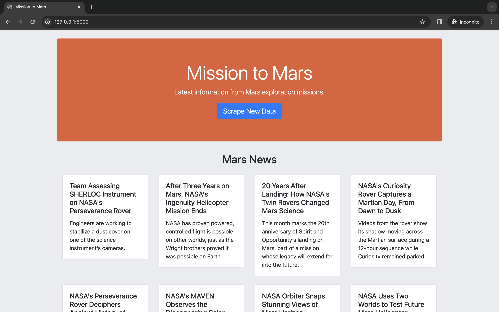

# Mission to Mars: A Web-Scraping Journey

## Background
This project presents a sophisticated web application designed to bring the forefront of Martian exploration directly to your screen. By harnessing the capabilities of Python, the application meticulously scrapes various scientific websites to gather the latest data on Mars missions. The back-end foundation is built with Flask, a micro web framework that efficiently routes and renders the collected data. At the same time, MongoDB is the backbone for data storage, ensuring the information is current and persistently available. The result is a user-friendly platform that educates and inspires by providing up-to-the-minute insights into our neighboring planet's exploration with the convenience of a single, intuitive interface. 
## Objective
This project aims to create an advanced web application that consolidates and displays the latest data from Mars exploration missions. Leveraging a suite of Python libraries encapsulated in a Jupyter Notebook titled `mission_to_mars.ipynb`; the application initiates the data acquisition process. This operation is conducted with the help of `Selenium`, which enables programmatic navigation of web pages to scrape content effectively. Using the `webdriver` and accompanying modules from `Selenium` facilitates the automation of browser interactions, including retrieving up-to-date news, full-size images, and detailed Mars facts.

Data scraping involves acquiring the latest news from the NASA Mars News Site, featuring titles and paragraph text, and obtaining the current featured Mars image from JPL's space images archive. Additionally, tabular data about Mars, such as diameter and mass, are extracted from the Mars Facts webpage and converted into HTML table strings using `pandas`. High-resolution images and information for Mars's hemispheres are captured and organized using Python dictionaries.

Post data collection, the project transitions to its next phase, which involves displaying the scraped data via a web application developed with Flask and MongoDB. This segment includes the transformation of the Jupyter Notebook into a Python script, `scrape_mars.py`, which contains a `scrape` function. This function is then invoked through a `/scrape` route within the Flask application to update the Mars data in the MongoDB database. The root route `/` renders the aggregated data into an HTML template, `index.html`, designed to present the information in a user-friendly format.

Dependencies like `ChromeDriverManager` ensure the automated scraping process is executed with an up-to-date browser driver, and `StringIO` is utilized for efficient in-memory string processing. This project aims to offer an educational and engaging experience for users interested in Mars exploration by showcasing the efficacy of web scraping techniques in gathering and presenting diverse web content.
## File Descriptions
```text
missions_to_mars/
├── app.py                      
├── scrape_mars.py              
├── mission_to_mars.ipynb       
├── templates/                  
│   └── index.html              
└── static/                     
    └── css/                    
        └── styles.css
```
This web application comprises several essential files that work together to scrape, process, and display Mars exploration data. Below is a breakdown of each file and its role within the project:
* `mission_to_mars.ipynb`: This Jupyter Notebook is the starting point for our scraping process. It uses Python and libraries like Selenium to automate data collection from various sources. The notebook contains detailed comments explaining each step of the scraping procedure, making it easy for others to understand and modify the code if needed.
* `scrape_mars.py`: Derived from the Jupyter Notebook, this Python script encapsulates the scraping logic into a `scrape()` function. When executed, it gathers the latest Mars exploration data and returns it as a Python dictionary, ready for storage in MongoDB.
* `app.py`: This is the Flask application's main file. It defines the server routes that handle requests from the web interface. The `/scrape` route triggers the `scrape()` function from `scrape_mars.py` and updates the database with fresh data. The root route `/` queries the database and populates the `index.html` template with the Mars data for display.
* `index.html`: Located within the `templates` folder, this HTML file is the application's front end. It is designed to structure and display the scraped data in a user-friendly format. The template includes placeholders dynamically filled with data from the MongoDB database when the Flask app renders it.
* `styles.css`: Situated within the `static` folder, this Cascading Style Sheet (CSS) file is responsible for the styling of the web application. It defines the visual appearance of the HTML elements on the webpage, ensuring that the Mars data presentation is engaging and accessible.
## Implementation
In the Implementation section of our Mars Exploration Web Application, we meticulously outline the step-by-step process and methodologies employed to bring this project from concept to reality, detailing the integration of data scraping, backend development, and frontend presentation.
### Jupyter Notebook
#### Selenium Web Scraping Setup
```python
# Dependencies
from selenium import webdriver
from selenium.webdriver.chrome.service import Service
from selenium.webdriver.common.by import By
from selenium.webdriver.support.ui import WebDriverWait
from selenium.webdriver.support import expected_conditions as EC
from IPython.display import Image, display
import pandas as pd
from webdriver_manager.chrome import ChromeDriverManager
from io import StringIO
```
This code initializes a Selenium WebDriver for Chrome using `ChromeDriverManager`, enabling automated web scraping and data handling with `pandas`, and supports image display in IPython environments. 
#### Web Scraping and Image Display with Selenium
```python
# Function to initialize and return the WebDriver
def initialize_webdriver():
    service = Service(ChromeDriverManager().install())
    driver = webdriver.Chrome(service=service)
    return driver

# Function to fetch and display an image from a given URL
def fetch_and_display_image(url, css_selector="img.wide-image", base_url="https://astrogeology.usgs.gov"):
    # Call initialize_webdriver() to get a WebDriver instance
    driver = initialize_webdriver()
    
    try:
        # Navigate to the website
        driver.get(url)
        
        # Extract the image src
        image_element = driver.find_element(By.CSS_SELECTOR, css_selector)
        image_src = image_element.get_attribute('src')
        
        # Construct the absolute URL
        image_url = base_url + image_src if image_src.startswith('/') else image_src
        
        # Close the driver
        driver.quit()
        
        # Display the image in the notebook
        display(Image(url=image_url))
        
    except Exception as e:
        print(f"An error occurred: {e}")
        # Ensure the driver is closed even if an exception occurs
        driver.quit()
```
This code includes two functions for web scraping using Selenium: `initialize_webdriver` initializes a Chrome WebDriver, and `fetch_and_display_image` fetches and displays an image from a specified URL using a CSS selector.
#### Extracting Latest Mars News with Selenium
```python
# Call initialize_webdriver() to get a WebDriver instance
driver = initialize_webdriver()

# Navigate to the website
url = "https://mars.nasa.gov/news/?page=0&per_page=40&order=publish_date+desc%2Ccreated_at+desc&search=&category=19%2C165%2C184%2C204&blank_scope=Latest"
driver.get(url)

# Wait for the page to load and titles to appear
wait = WebDriverWait(driver, 10)
wait.until(EC.visibility_of_element_located((By.CSS_SELECTOR, "ul.item_list li.slide")))

# Retrieve titles and details
articles = driver.find_elements(By.CSS_SELECTOR, "ul.item_list li.slide")
for article in articles:
    title = article.find_element(By.CSS_SELECTOR, "div.content_title").text
    details = article.find_element(By.CSS_SELECTOR, "div.article_teaser_body").text
    print(f"Title: {title}\nDetails: {details}\n")

# Close the driver
driver.quit()
``` 
This script uses Selenium to navigate to NASA's Mars news website, waits for the news articles to load, and then scrapes the titles and summaries of the latest articles, printing each to the console. It demonstrates explicit waits to ensure elements are visible before interaction and clean resource management by closing the WebDriver after execution.
#### Displaying Mars Image of the Week
```python
# Call initialize_webdriver() to get a WebDriver instance
driver = initialize_webdriver()

# Navigate to the website
url = "https://mars.nasa.gov/mars2020/multimedia/raw-images/image-of-the-week/"
driver.get(url)

# Wait for the main image to load
wait = WebDriverWait(driver, 10)
image_element = wait.until(EC.presence_of_element_located((By.CSS_SELECTOR, "div.main_image img")))

# Retrieve the image URL
image_url = image_element.get_attribute('src')

# Close the driver
driver.quit()

# Display the image in the notebook
display(Image(url=image_url))
```
Here, we are retrieving and displaying the "Image of the Week" from the Mars 2020 mission using Selenium for web navigation and dynamic content loading.
#### Extracting Mars Facts to DataFrame
```python
# Call initialize_webdriver() to get a WebDriver instance
driver = initialize_webdriver()

# Navigate to the website
url = "https://mars.nasa.gov/all-about-mars/facts/"
driver.get(url)

# Extract the table HTML
table_html = driver.find_element(By.CSS_SELECTOR, "table.mb_table").get_attribute('outerHTML')

# Close the driver
driver.quit()

# Convert the HTML table to a pandas DataFrame
df = pd.read_html(StringIO(table_html))[0]

# Rename DataFrame columns for clarity
df.columns = ['Metric', 'Earth', 'Mars']

# Display df
df
```
Then, we extracted a comparison table of Mars and Earth facts from NASA's website and converted it into a pandas DataFrame for analysis and display.  
#### Showcasing Cerebus Enhanced Mars Image
```python
# URL of the website containing the image to fetch and display
url = "https://astrogeology.usgs.gov/search/map/Mars/Viking/cerberus_enhanced"

# Call the function to fetch and display the image
fetch_and_display_image(url)
```
Next, we will fetch and display an enhanced image of Mars from the USGS website by leveraging a predefined function that automates web navigation and image extraction.
#### Showingcasing Syrtis Major Enhanced Mars Image
```python
# URL of the website containing the image to fetch and display
url = "https://astrogeology.usgs.gov/search/details/Mars/Viking/syrtis_major_enhanced/tif#:~:text=Mosaic%20of%20the%20Syrtis%20Major,in%20an%20point%20perspective%20projection."

# Call the function to fetch and display the image
fetch_and_display_image(url)
```
We will do the same here but change the url to fetch the Syrtis Major. 
#### Displaying Schiaparelli Enhanced Mars Image
```python
# URL of the website containing the image to fetch and display
url = "https://astrogeology.usgs.gov/search/map/Mars/Viking/schiaparelli_enhanced"

# Call the function to fetch and display the image
fetch_and_display_image(url)
```
Apply the same function to retrieve the Schiaparelli image. 
#### Displaying the Valles Marineris Enhanced Mars Image
```python
# URL of the website containing the image to fetch and display
url = "https://astrogeology.usgs.gov/search/map/Mars/Viking/valles_marineris_enhanced#:~:text=Mosaic%20of%20the%20Valles%20Marineris,6km%2Fpixel."

# Call the function to fetch and display the image
fetch_and_display_image(url)
```
Lastly, retrieve the Valles Marineris image.
### Scrape Mars
Now we are going to convert our Jupyter notebook into a Python script called `scrape_mars`.py by using a function called `scrape`. 
#### Dependencies
```python
# scrape_mars.py
from selenium import webdriver
from selenium.webdriver.chrome.service import Service
from selenium.webdriver.common.by import By
from selenium.webdriver.support.ui import WebDriverWait
from selenium.webdriver.support import expected_conditions as EC
import pandas as pd
from webdriver_manager.chrome import ChromeDriverManager
from io import StringIO
```
First, we import all necessary libraries for web automation and data manipulation. 
#### Function to Initialize the WebDriver
```python
# Function to initialize and return the WebDriver
def initialize_webdriver():
    service = Service(ChromeDriverManager().install())
    driver = webdriver.Chrome(service=service)
    return driver
```
Next, we create a function that sets up and returns a Selenium WebDriver for Chrome. We automate browser setup by downloading the latest ChromeDriver version using `ChromeDriverManager`, ensuring our web scraping is always up-to-date and ready for action. 
#### Function to Fetch and Process an Image URL
```python
# Function to fetch and display an image from a given URL
def fetch_image_url(url, css_selector="img.wide-image", base_url="https://astrogeology.usgs.gov"):
    driver = initialize_webdriver()
    try:
        driver.get(url)
        image_element = driver.find_element(By.CSS_SELECTOR, css_selector)
        image_src = image_element.get_attribute('src')
        image_url = base_url + image_src if image_src.startswith('/') else image_src
    except Exception as e:
        print(f"An error occurred: {e}")
        image_url = None
    finally:
        driver.quit()
    return image_url
``` 
Then, we set up a function that navigates to a specified URL using a Selenium WebDriver, searches for an image element using a CSS selector, and constructs the image's full URL by conditionally appending a base URL. It handles errors and ensures the WebDriver is adequately closed after operation, returning the final image URL for use. 
#### Scrape Function
```python
def scrape():
    scraped_data = {}

    # Initialize WebDriver
    driver = initialize_webdriver()

    # NASA Mars News
    try:
        url = "https://mars.nasa.gov/news/?page=0&per_page=40&order=publish_date+desc%2Ccreated_at+desc&search=&category=19%2C165%2C184%2C204&blank_scope=Latest"
        driver.get(url)
        wait = WebDriverWait(driver, 10)
        wait.until(EC.visibility_of_element_located((By.CSS_SELECTOR, "ul.item_list li.slide")))
        articles = driver.find_elements(By.CSS_SELECTOR, "ul.item_list li.slide")
        news = [{'title': article.find_element(By.CSS_SELECTOR, "div.content_title").text,
                 'details': article.find_element(By.CSS_SELECTOR, "div.article_teaser_body").text} for article in articles]
        scraped_data['news'] = news
    finally:
        driver.quit()

    # Mars Featured Image
    driver = initialize_webdriver()
    try:
        url = "https://mars.nasa.gov/mars2020/multimedia/raw-images/image-of-the-week/"
        driver.get(url)
        wait = WebDriverWait(driver, 10)
        image_element = wait.until(EC.presence_of_element_located((By.CSS_SELECTOR, "div.main_image img")))
        scraped_data['featured_image'] = image_element.get_attribute('src')
    finally:
        driver.quit()

    # Mars Facts
    driver = initialize_webdriver()
    try:
        url = "https://mars.nasa.gov/all-about-mars/facts/"
        driver.get(url)
        table_html = driver.find_element(By.CSS_SELECTOR, "table.mb_table").get_attribute('outerHTML')
        df = pd.read_html(StringIO(table_html))[0]
        df.columns = ['Metric', 'Earth', 'Mars']
        scraped_data['mars_facts'] = df.to_dict('records')
    finally:
        driver.quit()

    # Mars Hemisphere Images
    image_urls = [
        "https://astrogeology.usgs.gov/search/map/Mars/Viking/cerberus_enhanced",
        "https://astrogeology.usgs.gov/search/details/Mars/Viking/syrtis_major_enhanced/tif#:~:text=Mosaic%20of%20the%20Syrtis%20Major,in%20an%20point%20perspective%20projection.",
        "https://astrogeology.usgs.gov/search/map/Mars/Viking/schiaparelli_enhanced",
        "https://astrogeology.usgs.gov/search/map/Mars/Viking/valles_marineris_enhanced#:~:text=Mosaic%20of%20the%20Valles%20Marineris,6km%2Fpixel."
    ]
    hemisphere_images = [fetch_image_url(url) for url in image_urls]
    scraped_data['hemisphere_images'] = hemisphere_images

    return scraped_data
```
This `scrape` function orchestrates a comprehensive data collection process involving multiple web scraping tasks to aggregate a variety of Mars-related information. It initializes a WebDriver multiple times to navigate through different sections of the NASA Mars website and other sources, collecting latest news, a featured image, facts about Mars, and hemisphere images. Each section is wrapped in try-finally blocks to ensure resources are released properly. The function meticulously gathers and organizes data into a dictionary, `scraped_data`, which includes news articles, the featured Mars image URL, a table of Mars facts converted to a dictionary, and a list of Mars hemisphere images. This organized approach ensures a rich compilation of Mars data, ready for further analysis or display.
#### Executing the Mars Scraping Script
```python
if __name__ == "__main__":
    result = scrape()
    print(result)
```
This conditional block checks if the script is being run as the main program and not being imported as a module in another script. If it is the main program, it calls the scrape function to collect Mars-related data across different categories, including news, images, and facts. Upon completion, it prints the aggregated results to the console. This setup is ideal for testing or directly running the script to perform the scraping tasks and immediately see the output, showcasing the versatility and direct application of the scraping functions developed.
### Flask App
For the last step we will setup our Flask App. 
```python
from flask import Flask, render_template, redirect
from flask_pymongo import PyMongo
import scrape_mars

# Create an instance of Flask
app = Flask(__name__)

# Use PyMongo to establish Mongo connection
app.config["MONGO_URI"] = "mongodb://localhost:27017/mars_app"
mongo = PyMongo(app)

# Route to render index.html template using data from Mongo
@app.route("/")
def index():
    mars_data = mongo.db.collection.find_one()
    return render_template("index.html", mars=mars_data)

# Route that will trigger the scrape function
@app.route("/scrape")
def scrape():
    # Run the scrape function
    mars_data = scrape_mars.scrape()

    # Update the Mongo database using update_one and upsert=True
    mongo.db.collection.update_one({}, {'$set': mars_data}, upsert=True)

    # Redirect back to home page
    return redirect("/", code=302)

if __name__ == "__main__":
    app.run(debug=True)
```
This script defines a Flask web application that serves Mars-related data, collected by the `scrape_mars.py` script, through a simple web interface. It establishes a connection to a MongoDB database to store and retrieve the scraped data. With two routes defined, one displays the data on an `i`ndex.html` page, and the other triggers the scraping process to update the database with fresh data, ensuring users always have access to the latest information about Mars directly from their web browser.